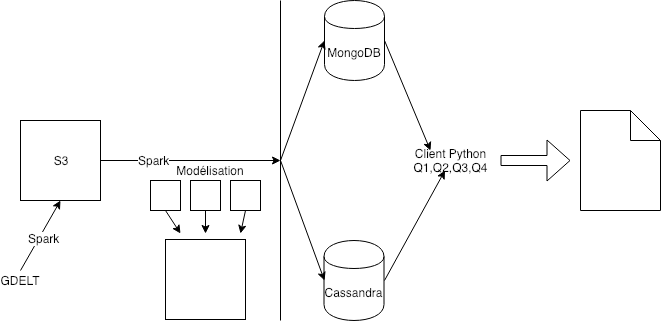

# Projet Bigdata
<a style="color: black" href="http://andreiarion.github.io/">projet</a>
## But
Analyser l’année 2018 via la base de données *GDELT* en utilisant le **tone**  des articles dans les medias des divers pays du monde

## Questions à répondre 

1. le nombre d’articles/evenements pour chaque (jour, pays de l’evenement, langue de l’article)
2. pour un acteur(pays/organisation ...) ⇒ afficher les evenements qui y font reference
3. les sujets (acteurs) qui ont eu le plus d’articles positifs/negatifs (mois, pays, langue de l’article).
4. acteurs/pays/organisations qui divisent le plus 
## Schéma

